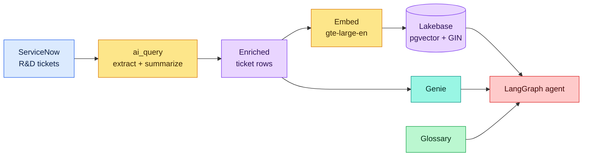
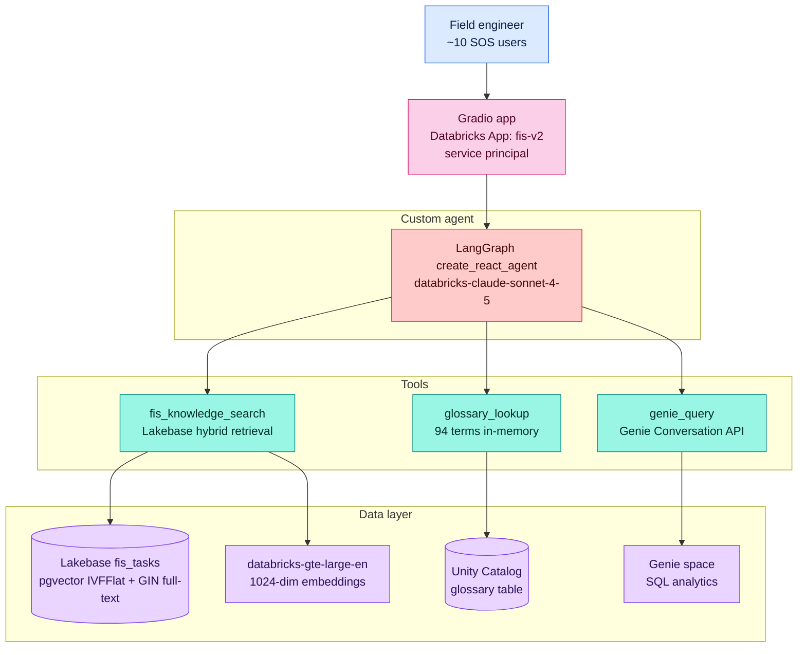
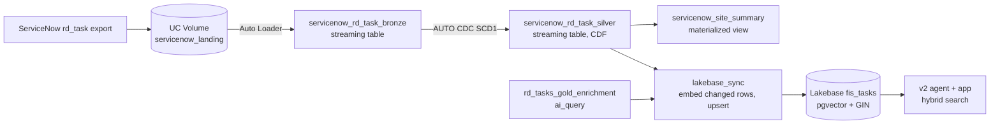

# Architecture

Architecture reference for the field-repair knowledge assistant. For what it is
and why, see the **[README](README.md)**; to stand it up in your own workspace,
follow **[DEPLOYMENT.md](DEPLOYMENT.md)**.

This project is an **integration blueprint** — a working, deployable Databricks
solution you point at your own maintenance & repair tickets, not a throwaway demo.
The worked example (roadside truck-screening R&D) ships so the system is live on
day one; swap the corpus and glossary and the same machinery serves any
maintenance & repair domain.

> [!NOTE]
> **v2 architecture.** The current system is a **custom LangGraph agent** backed by
> **Lakebase (Postgres + pgvector)** for retrieval. This replaces the earlier v1
> Agent Bricks stack — the **Knowledge Assistant (KA)** and **Multi-Agent
> Supervisor (MAS)** are gone. What carried over: the Unity Catalog ingest +
> `ai_query` enrichment path, the governed glossary, and the Genie space for
> quantitative analytics. The v2-specific docs live under
> [`v2/docs/`](v2/docs/ARCHITECTURE_V2.md).

## System Overview

This project turns an organization's siloed ServiceNow R&D troubleshooting history
into a cited, conversational knowledge agent. The example corpus that ships with the
blueprint is a roadside truck-screening R&D operation; swap the corpus and glossary
and the same machinery serves any maintenance & repair domain. Its input is a
natural-language question from an R&D/field-support engineer facing an incomplete or
open task (for example, a WIM reporting zero weights, an AUR camera failing, or an
HTS web app crashing). Its output is a cited, actionable recommendation grounded in
the most relevant prior cases.

Architecturally it is a **retrieval-and-orchestration** system layered on Unity
Catalog and Lakebase. A canonical Delta table is enriched **once** by `ai_query`;
the enriched rows are then embedded and loaded into a **Lakebase** table
(`fis_tasks`) that holds both a `pgvector` embedding column and a full-text `tsvector`
index. A **custom LangGraph agent** (`create_react_agent`, powered by
`databricks-claude-sonnet-4-5` via `ChatDatabricks`) orchestrates three tools:
a **hybrid-search retriever** over Lakebase (vector + full-text), an **in-memory
glossary lookup** (94 approved domain terms), and a **Genie query** tool for
natural-language-to-SQL analytics. A **Gradio chat app**, deployed as a Databricks
App under a service principal, is the front door. The system runs on Databricks
serverless plus a Lakebase endpoint.

The question workload is characterized by three routing signals the agent's system
prompt encodes: **qualitative** troubleshooting/root-cause/resolution questions route
to the Lakebase retriever; **unknown terms and acronyms** route to the glossary (often
chained before a search); and **quantitative** counting/ranking/aggregation questions
route to Genie.

## Logical View

A single enrichment path turns the ServiceNow source into structured, enriched rows;
those rows are embedded and loaded into Lakebase; and the agent takes three tool
inputs (Lakebase retriever, glossary, Genie):



One `ai_query` call turns raw tickets into structured rows — it both **extracts** the
canonical enum columns (systems, vendors, problem category, root cause, resolution
type) and **summarizes** the free-text description, segmenting it by meaning into
`summary` / `customer_impact` / `troubleshooting` / `recommendation`. Those enriched
rows fork two ways: they are embedded with `databricks-gte-large-en` and loaded into
**Lakebase** for hybrid semantic + full-text retrieval, and they back the **Genie**
space for NL→SQL analytics. The **LangGraph agent** orchestrates the Lakebase
retriever, Genie, and an in-memory **glossary** loaded from a governed Unity Catalog
table. The detailed component diagram below expands each of these into the actual
Databricks assets.

## Component Diagram



Upstream (not shown above): raw ServiceNow markdown plus synthetically generated
tickets land in the canonical `rnd_tickets` Delta table; a silver build and an
incremental `ai_query` gold enrichment (`content_hash` anti-join + `MERGE`, so the
LLM runs only on new/changed tickets) produce the enriched columns. v2 then embeds
those rows with `databricks-gte-large-en` and loads them into the **Lakebase**
`fis_tasks` table (`lakebase_text` + `lakebase_vector`), and the same enriched rows
back the Genie space. At query time the agent never touches the pipeline — it reads
Lakebase, the glossary table, and Genie directly.

## ServiceNow Ingestion (Lakeflow)

ServiceNow tickets enter the lakehouse through a **Lakeflow Spark Declarative
Pipeline** (`resources/pipeline_servicenow.yml`, SQL in
`src/pipelines/servicenow_ingest/`). The `rkb_data_pipeline` job runs it in two tasks:

1. **`land_servicenow`** writes ServiceNow `rd_task` exports (newline-delimited JSON,
   Table API shape with `sys_id` / `sys_updated_on`) into the
   `servicenow_landing` UC Volume. This stands in for the scheduled ServiceNow export.
2. **`servicenow_lakeflow`** triggers the serverless pipeline:
   - `servicenow_rd_task_bronze`: streaming table, Auto Loader (`STREAM read_files`)
     over the landing Volume, rows without a ticket number dropped by expectation.
   - `servicenow_rd_task_silver`: streaming table fed by `AUTO CDC` (SCD Type 1,
     keyed on `number`, sequenced by `sys_updated_on`), typed columns, a
     `content_hash` for incremental enrichment, Change Data Feed on.
   - `servicenow_site_summary`: materialized view with per-site, per-status counts,
     backlog, and age for the SOS team and Genie.

Auto Loader only reads files it hasn't seen and Auto CDC upserts by ticket, so
re-landing an export is idempotent.



3. **`lakebase_sync`** (serverless notebook, `src/notebooks/lakebase_sync.py`) joins
   Lakeflow silver with the parsed location fields and the `ai_query` enrichment,
   compares each ticket's `content_hash` with what Lakebase already holds, embeds only
   new or changed tickets with `databricks-gte-large-en`, and upserts them into
   Lakebase `fis_tasks` (`ON CONFLICT (number)`). It also ensures the pgvector column,
   the primary key, and the GIN full-text index exist. That is the low-latency store
   the v2 agent and app query, so the path from a landed ServiceNow export to an answer
   in the app is one job run.

## Data Flow

A typical question moves through the system as follows:

1. **Entry.** An SOS engineer asks a question through the Gradio chat app (a
   Databricks App running under its own service principal, granted read access to
   Lakebase and the glossary/Genie assets).
2. **Agent reasoning.** The LangGraph `create_react_agent` receives the message. Its
   system prompt encodes the routing rules; the LLM (`databricks-claude-sonnet-4-5`)
   decides which tool(s) to call, and may call more than one in a turn.
3. **Terminology resolution.** When the question contains an unfamiliar acronym or
   term (OVC, PIPS, WIM, AUR, Kistler, Neology, CA, …), the agent calls
   `glossary_lookup` first. Lookup is exact match on term → exact match on any alias →
   fuzzy `difflib` match (cutoff 0.5) → "not found". The 94 approved terms are
   pre-loaded into memory at startup, so no runtime query is needed.
4. **Retrieval.**
   - **Qualitative** questions (troubleshooting, root cause, resolution, a specific
     task number) → `fis_knowledge_search`. The query is embedded, then a **hybrid**
     SQL query against Lakebase combines **vector similarity** (0.7 weight, cosine
     distance over the IVFFlat index) and **full-text ranking** (0.3 weight,
     `ts_rank_cd` over the GIN index), with optional `location_state` / `status`
     filters, returning the top 5 cases with their real ticket numbers.
   - **Quantitative** questions (counts, rankings, aggregations, percentages, trends)
     → `genie_query`, which drives the Genie Conversation API (`start_conversation` →
     poll to `COMPLETED`, 90s timeout) and returns the text answer, the generated SQL,
     and the result set formatted as a markdown table (max 20 rows).
5. **Synthesis.** The agent merges tool outputs into one cited, actionable answer,
   citing specific task numbers (e.g., `R&DTASK0002200`) and declining to fabricate
   when nothing relevant is found.
6. **Output.** The answer is streamed back to the user in the Gradio app.

## Key Abstractions

The system is a mix of Databricks-native assets (the upstream pipeline, Genie,
Lakebase) and a small custom agent codebase under `v2/`. The most significant
abstractions:

- **Bronze canonical table** — `<catalog>.<schema>.rnd_tickets`. One row per R&D case,
  holding the full `case_text`, typed metadata columns, and the `metadata` STRUCT,
  with Change Data Feed enabled. It is the source of truth the silver/gold layers
  derive from.
- **Enrichment gold layer** — `rd_tasks_gold_enrichment` (a Delta table, incrementally
  `MERGE`-upserted, gated by `content_hash`). `ai_query`-driven enrichment adds
  canonical structured columns (`systems_involved`, `hardware`, `vendors`,
  `problem_category`, `root_cause`, `resolution_type`) plus a segmented description
  (`summary` / `customer_impact` / `troubleshooting` / `recommendation`). This layer
  feeds both the Lakebase load and the Genie space.
- **Lakebase serving table** — `fis_tasks`, in the Lakebase `fis` project
  (`production` branch, `primary` endpoint). A Postgres table holding the enriched
  columns plus `lakebase_text` (the composed, acronym-expanded content) and
  `lakebase_vector` (`vector(1024)` from `databricks-gte-large-en`). Two indexes power
  hybrid retrieval: an **IVFFlat** vector index (`idx_fis_tasks_vector`,
  `vector_cosine_ops`) and a **GIN** full-text index (`idx_fis_tasks_text` over
  `to_tsvector('english', lakebase_text)`).
- **`fis_knowledge_search` tool** — the hybrid retriever. Embeds the query, runs a
  single SQL statement that unions a vector-similarity CTE and a full-text-rank CTE
  and scores each row `0.7 * vector + 0.3 * text`, honoring optional `location_state`
  and `status_filter` predicates. Returns `TOP_K = 5` cases.
- **`glossary_lookup` tool** — the governed controlled vocabulary. 94 approved terms
  loaded at startup from the Unity Catalog `glossary` table (canonical term,
  definition, category, aliases) into a Python dict + alias index. Exact → alias →
  fuzzy match. A term becomes resolvable by being *approved*, not by a deploy.
- **`genie_query` tool** — NL→SQL analytics over the enriched rows via the Databricks
  SDK Genie Conversation API. Encodes involvement counting, open-task priority
  ranking, and delay/complexity signals as the Genie space's certified queries.
- **LangGraph agent** — a `create_react_agent` over the three tools, with a system
  prompt that carries the routing rules and answer style (cite task numbers, pass
  location filters, do not fabricate). LLM: `databricks-claude-sonnet-4-5` via
  `ChatDatabricks`. The agent is logged with MLflow (`mlflow.langchain.log_model`,
  model-from-code); Unity Catalog registration is currently gated on metastore quota
  and re-enabled by uncommenting the `registered_model_name` argument.
- **Foundation Model API endpoints** — `databricks-claude-sonnet-4-5` powers the agent
  and drives `ai_query` enrichment; `databricks-gte-large-en` produces the 1024-dim
  embeddings for both ingest and query time; `databricks-claude-haiku-4-5` powers the
  synthetic-ticket generation pass.
- **Front door** — a **Gradio** chat app (`v2/app/`) deployed as a Databricks App
  (`fis-v2`) under a service principal, which is granted a Lakebase role plus read
  access to the glossary table and Genie space.

## Directory Structure Rationale

The repository holds the **upstream data pipeline** as a Databricks Asset Bundle at
the root, and the **v2 custom agent** (the current serving architecture) under `v2/`.
The bundle root (`databricks.yml`) includes `resources/*.yml`; the scripts and
pipeline code the resources point at live under `src/`, `data_generation/`, `genie/`,
and `frontdoor/`. Top-level layout:

```
.
├── databricks.yml            Bundle definition (variables, targets, sync excludes)
├── resources/                DAB resources: uc.yml, genie.yml, apps.yml,
│                             jobs_pipeline.yml, jobs_agents.yml,
│                             pipeline_servicenow.yml (Lakeflow pipeline)
├── src/
│   ├── pipelines/            Lakeflow SDP SQL: servicenow_ingest/ (bronze Auto Loader,
│   │                         silver AUTO CDC, site summary MV)
│   ├── notebooks/            Serverless notebook tasks: enrich.py (gold enrichment) +
│   │                         serving.py (enriched serving rows + analytics + verify) +
│   │                         lakebase_sync.py (silver -> Lakebase fis_tasks);
│   │                         enrich_recipe.py is the shared, I/O-free recipe they import.
│   └── deploy/               Job-task scripts: parse_tickets, load_tables, build_glossary,
│                             render_genie (renders the Genie template), and the test
│                             harnesses + json/md inputs
├── data/servicenow/          The ticket corpus markdown (parse_tickets reads it); ships
│                             WITH the repo so the bundle is self-contained
├── data_generation/          build_silver.py (silver layer) + generate.py (synthetic corpus)
├── genie/                    genie_space.template.json (native DAB genie_spaces payload;
│                             rendered per catalog/schema by src/deploy/render_genie.py)
├── v2/                       The current architecture (Lakebase + custom LangGraph agent):
│   ├── agent/                fis_v2_agent.py — notebook: config, Lakebase connection,
│   │                         embedding, the 3 tools, agent definition, test, MLflow logging
│   ├── app/                  app.py (Gradio chat app with all 3 tools) + app.yaml
│   │                         (Databricks App config, Lakebase resource) + requirements.txt
│   ├── tests/                fis_v2_tests.py — 8 suites, 35+ tests
│   └── docs/                 plan_build.md, ARCHITECTURE_V2.md, DEPLOYMENT_V2.md
├── eval/                     MLflow GenAI evaluation harness (run_eval.py)
├── specifications/           Component specs (01 ingest+enrich, 02 agents, 03 apps)
└── DEPLOYMENT.md / README.md
```

- **`resources/` + `databricks.yml`** — the upstream bundle. Native resources (UC
  schema/volume, the `genie_spaces` Genie space) plus the jobs that run the imperative
  work DAB has no resource type for: the data pipeline (`jobs_pipeline.yml`) and the
  glossary build.
- **`src/`** — the pipeline job tasks: bronze ingest (`parse_tickets` → `load_tables`),
  the governed `glossary` + `glossary_lookup` builder, and the serverless notebooks
  that derive the gold enrichment (`enrich.py`, incremental via a `content_hash`
  anti-join + `MERGE`) and the enriched serving rows (`serving.py`). `enrich_recipe.py`
  is the single-source, I/O-free recipe (ai_query schema + acronym expansion) both import.
- **`v2/`** — the current serving architecture. `agent/fis_v2_agent.py` sets up the
  Lakebase table + indexes, defines the three tools and the LangGraph agent, and logs
  it with MLflow; `app/` is the Gradio Databricks App that runs the agent in-process
  behind a service principal; `tests/` is the test harness; `docs/` carries the
  v2-specific architecture and deployment guides.
- **`data_generation/`** — `build_silver.py` shapes bronze into `rd_tasks_silver`;
  `generate.py` is the one-time synthetic-corpus authoring tool (its output is
  pre-generated markdown that `parse_tickets` reads — not wired into the deploy job).
- **`eval/`** — the re-runnable MLflow GenAI evaluation harness (`run_eval.py`) that
  scores correctness, relevance, and citation-groundedness.
