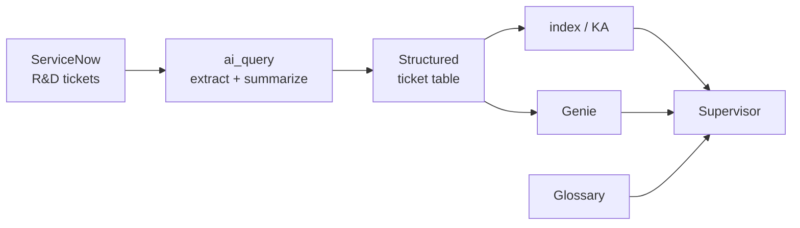
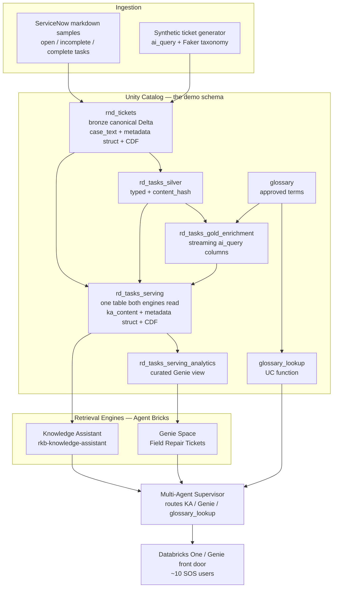

# FieldFix: a Multi-Agent Knowledge Assistant for Field Troubleshooting & Repair

**A Databricks solution template for a multi-agent knowledge assistant over your
organization's historical maintenance & repair troubleshooting tickets.**

A field engineer asks a question in plain English; a **Supervisor** routes it to a
**Knowledge Assistant** for similar-case retrieval with real ticket citations, or to
**Genie** for counts, expert-finding and triage, or both. The agent's controlled
vocabulary comes from a **governed glossary**, not from code, so a term becomes
extractable by being approved, not by a deploy. The domain is swappable: point it at
your own ticket corpus and glossary and the pipeline, agents, and app are unchanged.

**TL;DR**

- Ask in plain English → cited prior cases with **real ticket numbers**
- A **Supervisor** routes each question to a Knowledge Assistant, Genie, or both
- Controlled vocabulary lives in a **governed glossary**, not hardcoded in code
- **Domain-agnostic** — swap the corpus + glossary; pipeline, agents, and app are unchanged

## The example story

The template is domain-agnostic. It ships with the worked example below so you have
something live to explore on day one; swap the corpus and glossary and the same
machinery serves any maintenance & repair operation.

| | |
|---|---|
| **Example org** | A roadside truck-screening equipment operator (weigh-in-motion scales, plate/DOT readers, inspection cameras) running sites across US states and Canadian provinces |
| **Hero** | A field or R&D engineer holding an open, unresolved task |
| **Problem** | A decade of troubleshooting history in ServiceNow is effectively write-only. The engineer who solved this exact failure two years ago has moved on; their ticket is unfindable among thousands. So the team re-diagnoses from scratch, repeatedly. |
| **Investigation** | Ask the agent "a WIM site is reporting 0 weights, have we seen this before?" It returns the closest prior cases **with ticket numbers**, separates software/config causes from hardware causes, and ends with lowest-effort-first steps. |
| **Root cause (of the org problem)** | The knowledge existed the whole time. It was unretrievable because the useful content was buried in free-text notes with inconsistent jargon, and nothing mapped an acronym to its meaning. |
| **Impact** | Time-to-diagnosis drops from "search ServiceNow and hope" to one cited answer. Expert-finding and triage become SQL questions instead of tribal knowledge. |

---

## Overview

Every ticket is enriched **once** by an LLM into canonical structured columns:
`systems_involved`, `vendors`, `problem_category`, `root_cause`,
`resolution_type`, plus the free-text description segmented by *meaning* into
`summary` / `customer_impact` / `troubleshooting` / `recommendation`. That
segmentation is what makes the corpus retrievable: a raw ServiceNow description
is one wall of text mixing symptom, impact, what was tried and what to do next.

Both engines then read **one physical table**. The Knowledge Assistant indexes a
single pre-composed content column and cites via a `metadata` struct; Genie reads
the structured columns of the same rows through a commented view. Same rows, two
access patterns — so a semantic answer and an aggregate answer can never
disagree about the underlying data.

The governance thread is the part worth slowing down on in a demo. The
systems/vendors enums the LLM is allowed to emit are read **at run time** from
the glossary, filtered to `status='approved'`. Approve a term and the next
enrichment run can extract it. There is no hardcoded term list anywhere, and a
drift guard proves it by asserting the enrichment's system values and the approved
glossary set are identical in both directions.

---

## Key Numbers (shipped example corpus)

| Metric | Value |
|---|---|
| Tickets in corpus | 23 synthetic sample tickets (one row per task); extend or regenerate with the synthetic generator |
| Curated glossary terms | ~15 SME-approved seed terms (expandable acronyms plus systems/vendors), extended by mined proposals |
| Enrichment cost | one-time, a few dollars for the sample corpus; ongoing ~$0 (content-hash gated) |
| Query archetypes covered | 5: terminology, expert-finding, complexity/delay, priority triage, site-pattern |
| Agent surfaces | Knowledge Assistant + Genie space + Supervisor + front-door app |

---

## Business Value — closing the loop

**Faster field repair turns asset/equipment downtime back into revenue. Size it
with the customer, from their numbers.**

Where the value comes from:

`knowledge siloed across systems` → `agent finds the exact prior fix` →
`faster diagnosis, higher first-time-fix` → `shorter MTTR, fewer repeat dispatches` →
**`less downtime = revenue kept`**

### The revenue-loss-avoidance equation

```
  field faults per year          [THEIR DATA]
× hours of downtime per fault    [THEIR DATA — MTTR]
× % of MTTR the agent removes    [MEASURED in the demo]
× revenue / SLA penalty per downtime-hour   [THEY TELL YOU]
─────────────────────────────────────────────
= annual revenue protected   × attribution to Databricks (they set the %)
```

**Split the inputs honestly — it is what makes the number defensible:**

| Input | Who supplies it | Where it comes from |
|---|---|---|
| Fault volume, MTTR, first-time-fix rate | **Their data** | computed from their own ticket history |
| % of MTTR the agent removes | **Measured** | the demo — time-to-cited-answer vs. manual search |
| Revenue / SLA penalty per downtime-hour | **They tell you** | only the business can set this; never invent it |
| Attribution to Databricks | **They set it** | their call, not yours |


---


## Architecture

### System Overview

The Field Repair Knowledge Assistant is a Databricks Agent Bricks solution template that turns an organization's siloed ServiceNow R&D troubleshooting history into a cited, conversational knowledge agent. The example corpus that ships with the template is a roadside truck-screening R&D operation; swap the corpus and glossary and the same machinery serves any maintenance & repair domain. Its input is a natural-language question from an R&D/field-support engineer facing an incomplete or open task (for example, a WIM reporting zero weights, an AUR camera failing, or an HTS web app crashing). Its output is a cited, actionable recommendation grounded in the most relevant prior cases.

Architecturally it is a **retrieval-and-orchestration** system layered on Unity Catalog. A single canonical Delta table is the source of truth for every R&D case. Two complementary retrieval engines read that table — a **Knowledge Assistant (KA)** for semantic similar-case retrieval with citations, and a **Genie Space** for natural-language-to-SQL over structured columns. A **Multi-Agent Supervisor (MAS)** routes each question to the right engine (or fans out to both) and resolves domain jargon via a `glossary_lookup` Unity Catalog function. A brandable **Databricks One / Genie front door** puts the whole thing in front of the field-support team. The system runs entirely on Databricks serverless. Catalog and schema are bundle variables (default `main.troubleshooting_knowledge_agent`, overridable per workspace with `--var catalog=… --var schema=…`).

The question workload is characterized by five query archetypes drawn from the example acceptance script: terminology matching, domain-expert finding, task complexity/delay analysis, priority triage of open tasks, and site-specific recurring-issue detection. Semantic archetypes route to KA; structured/aggregate archetypes route to Genie; hybrid archetypes fan out to both.

### Logical View

At the logical level a single enrichment path turns the ServiceNow source into one structured table that **both** retrieval engines read, and the Supervisor takes three inputs (KA, Genie, glossary):



One `ai_query` call turns raw tickets into a structured table — it both **extracts** the canonical enum columns (systems, vendors, problem category, root cause, resolution type) and **summarizes** the free-text description, segmenting it by meaning into `summary` / `customer_impact` / `troubleshooting` / `recommendation`. **Both** engines then read that one table: **Genie** queries its structured columns with NL→SQL, while the **KA** indexes the same rows' pre-composed content column for semantic retrieval with citations. The **Supervisor** orchestrates KA, Genie, and the **Glossary** — the glossary being the governed controlled vocabulary. The detailed component diagram below expands each of these into the actual Databricks assets.

### Component Diagram



Data flows left-to-right: raw ServiceNow markdown plus synthetically generated tickets land in the canonical `rnd_tickets` Delta table; the data-generation step shapes that (real + synthetic) corpus into the `rd_tasks_silver` layer; two **serverless notebook job tasks** then derive the `ai_query` gold enrichment (`enrich.py` — incremental via a `content_hash` anti-join + `MERGE`, so the LLM runs only on new/changed tickets) and the consolidated `rd_tasks_serving` **plain Delta table** (`serving.py`) with its segmented, acronym-expanded content column; the KA and Genie read the enriched artifacts; the Supervisor orchestrates them plus the glossary function; and the front door exposes the Supervisor to end users. Bronze ingest, the silver build, and the SME-governed glossary run as job tasks feeding the enrichment. (The serving table is a plain table, not a materialized view, because the KA streams from it — an MV cannot be streamed.)

### Data Flow

A typical question moves through the system as follows:

1. **Entry.** An SOS engineer asks a question through the Databricks One / Genie front door, which routes to the Multi-Agent Supervisor under a single conversation and the user's own identity and grants.
2. **Terminology resolution.** The Supervisor calls the `glossary_lookup(term_query)` Unity Catalog function first when jargon needs disambiguation (for example, `CA` → Controller Application, `WPS` → PowerNode). It receives the term's canonical definition and `category` and passes the term plus category downstream. The `category` drives how the term is handled: a `system` term is matched as an array element, while a non-system term is matched as free text — the correctness fix that prevents a false zero count.
3. **Routing.** Based on the sub-agent tool descriptions, the Supervisor routes to the correct engine(s):
   - **Semantic archetypes** (terminology matching, similar-case retrieval, cross-site recurring patterns) → Knowledge Assistant.
   - **Structured/aggregate archetypes** (counts, priority sorting, involvement counts) → Genie Space.
   - **Hybrid archetypes** (expert-finding, complexity/delay, priority triage) → both engines, fanned out and merged.
4. **Retrieval.** The KA performs instructed retrieval over the indexed ticket content and returns similar prior cases with inline citations that resolve to the source ticket. Genie generates SQL against the curated analytics view and returns aggregates, ranked lists, or involvement counts.
5. **Synthesis.** The Supervisor merges the sub-agent results into one cited, actionable answer, applying routing/synthesis instructions that shape marquee answers (for example, priority triage classifies open tasks as easiest-with-known-fix / oldest-but-blocked / stubborn-recurring, each with a ticket pointer).
6. **Output.** The answer is returned to the user through the front door with citations that resolve back to real corpus tickets.

### Key Abstractions

The system is composed of Databricks-native assets rather than application source code. The most significant abstractions:

- **Bronze canonical table** — `<catalog>.<schema>.rnd_tickets`. One row per R&D case, holding the full `case_text`, typed metadata columns, and the `metadata` STRUCT, with Change Data Feed enabled. It is the source of truth the silver/gold/serving layers derive from.
- **The one serving table** — `rd_tasks_serving`, the single physical table **both** engines read: the KA-indexed `ka_content` column, the `metadata` STRUCT, and CDF enabled. It is a **plain Delta table** (not a view or materialized view) so the Knowledge Assistant can *stream* from it — streaming from an MV is unsupported. Built in-job by the `serving` notebook (`src/notebooks/serving.py`).
- **Enrichment gold layer** — `rd_tasks_gold_enrichment` (a Delta table, incrementally `MERGE`-upserted, gated by `content_hash`). `ai_query`-driven enrichment adds canonical structured columns (`systems_involved`, `hardware`, `vendors`, `problem_category`, `root_cause`, `resolution_type`) plus a segmented description (`summary` / `customer_impact` / `troubleshooting` / `recommendation`). Genie's read surface is the curated view `rd_tasks_serving_analytics` (with `rd_tasks_gold_analytics` kept as a compatibility alias) over `rd_tasks_serving`.
- **Governed glossary** — the `glossary` table (canonical term, definition, category, synonyms/aliases, approved_by, version) and the `glossary_lookup(term_query STRING) RETURNS TABLE(term STRING, definition STRING, category STRING)` Unity Catalog function. Sourced from product docs (authoritative) merged with ServiceNow usage evidence; only approved terms are served. This is the controlled vocabulary that drives both enrichment enums and the Supervisor's terminology resolution.
- **Knowledge Assistant (KA)** — `rkb-knowledge-assistant`, served at endpoint `ka-97df484b-endpoint`. An Agent Bricks Instructed Retriever indexing `rd_tasks_serving.ka_content` plus a glossary Volume source; returns similar-case answers with resolving citations. Queried via `POST /serving-endpoints/{endpoint}/invocations`.
- **Genie Space** — `Field Repair Tickets` (space_id `<genie-space-id>`). Natural-language-to-SQL over `rd_tasks_serving_analytics`, encoding involvement counting, open-task priority ranking, and delay/complexity signals as certified queries and instructions.
- **Multi-Agent Supervisor (MAS)** — orchestrates the three tools (KA endpoint, Genie space, `glossary_lookup` function) under one conversation. Routing is driven by sharp, disambiguating natural-language tool descriptions rather than hard-coded rules. Supervisor LLM is `databricks-claude-sonnet-4-5`. <!-- VERIFY: MAS serving endpoint id and routing-instruction contents — Agent Bricks MAS metadata is not exposed via the serving API and must be read from the Agent Bricks UI -->
- **Foundation Model API endpoints** — `databricks-claude-sonnet-4-5` powers the agents (synthesis, reasoning) and drives `ai_query` enrichment; `databricks-claude-haiku-4-5` powers the synthetic-ticket generation pass.
- **Front door** — Databricks One (with Genie as the fallback front door) provides the brandable entry point for the SOS users and routes to the Supervisor. <!-- VERIFY: Databricks One GA availability and consumer-access entitlement state in the reference workspace -->

### Directory Structure Rationale

This repository is a Databricks Asset Bundle — the running system lives as Databricks
assets, not as an application source tree. The bundle root (`databricks.yml`) includes
`resources/*.yml`; the scripts and pipeline code the resources point at live under `src/`,
`data_generation/`, `genie/`, and `frontdoor/`. Top-level layout:

```
.
├── databricks.yml            Bundle definition (variables, targets, sync excludes)
├── resources/                DAB resources: uc.yml, genie.yml, apps.yml,
│                             jobs_pipeline.yml, jobs_agents.yml
├── src/
│   ├── notebooks/            Serverless notebook tasks: enrich.py (gold enrichment) +
│   │                         serving.py (plain-Delta rd_tasks_serving + analytics + verify);
│   │                         enrich_recipe.py is the shared, I/O-free recipe they import.
│   └── deploy/               Job-task scripts: parse_tickets, load_tables, build_glossary,
│                             build_serving_table (LOCAL analytics + verify CLI), build_ka +
│                             build_serving_agents (KA over rd_tasks_serving), build_supervisor
│                             (MAS), render_genie (renders the Genie template), frontdoor_deploy,
│                             env, preflight, the test_* harnesses + json/md inputs
├── data/servicenow/          The ticket corpus markdown (parse_tickets reads it); ships
│                             WITH the repo so the bundle is self-contained
├── data_generation/          build_silver.py (silver layer) + generate.py (synthetic corpus)
├── genie/                    genie_space.template.json (native DAB genie_spaces payload;
│                             rendered per catalog/schema by src/deploy/render_genie.py)
├── frontdoor/                FastAPI + built SPA front-door app (deployed via apps.yml)
├── eval/                     MLflow GenAI evaluation harness (run_eval.py)
├── specifications/           Component specs (01 ingest+enrich, 02 agents, 03 apps)
└── DEPLOYMENT.md / README.md
```

- **`resources/` + `databricks.yml`** — the bundle. Native resources (UC schema/volume,
  the `genie_spaces` Genie space, and the front-door app) plus the jobs that run the
  imperative work DAB has no resource type for: the data pipeline (`jobs_pipeline.yml` →
  the `rkb_data_pipeline` job) and the Agent Bricks + OBO-authz builds (`jobs_agents.yml` →
  `rkb_agents` + `rkb_frontdoor_authz`). There is **no Lakeflow pipeline** — the KA streams
  from `rd_tasks_serving`, which must be a plain Delta table (an MV cannot be streamed), so
  the `serving` notebook builds it.
- **`src/deploy/`** — the job-task scripts: bronze ingest (`parse_tickets` → `load_tables`),
  the governed `glossary` + `glossary_lookup` builder, the analytics-view + `--verify` step
  (`build_serving_table.py`), and the Agent Bricks builds DAB cannot express natively
  (`build_serving_agents.py` for the KA, `build_supervisor.py` for the MAS) with their
  `test_*.py` isolation harnesses and glossary/example inputs. The Genie Space is NOT
  script-built — it is the native `genie_spaces` resource (`resources/genie.yml`) whose
  payload is rendered per catalog/schema by `src/deploy/render_genie.py` from
  `genie/genie_space.template.json`; `test_genie.py` exercises it.
- **`src/notebooks/`** — the two serverless notebook job tasks that derive the gold layer:
  `enrich.py` builds `rd_tasks_gold_enrichment` (LLM `ai_query`, incremental via a
  `content_hash` anti-join + `MERGE`) and `serving.py` builds the `rd_tasks_serving` **plain
  Delta table** both engines read (then the analytics views + `verify()`). `enrich_recipe.py`
  is the single-source, I/O-free recipe (ai_query schema + acronym expansion) they both import.
- **`data_generation/`** — `build_silver.py` shapes bronze into `rd_tasks_silver`; `generate.py`
  is the one-time synthetic-corpus authoring tool (its output is pre-generated markdown that
  `parse_tickets` reads — not wired into the deploy job).
- **`frontdoor/`** — the front-door app (FastAPI + built SPA) uploaded via
  `resources/apps.yml`; OBO scopes are bound post-deploy by `src/deploy/frontdoor_deploy.py`.
- **`eval/`** — the re-runnable MLflow GenAI evaluation harness (`run_eval.py`) that scores
  correctness, relevance, and citation-groundedness.

---

## Running it in your own workspace

Follow DEPLOYMENT.MD

---

## License

© 2026 Databricks, Inc. All rights reserved. The source in this project is provided
subject to the Databricks License (see [`LICENSE.md`](LICENSE.md)). All included or referenced
third-party libraries are subject to their own licenses.

## Disclaimer

This project and its contents are provided **as-is**, for demonstration purposes only, and
are **not** formally supported by Databricks under any Service Level Agreements. It is
intended as a solution accelerator you adapt to your own data and workspace; deploy and run
it at your own risk. Nothing here constitutes a commitment to deliver any feature or
functionality.
