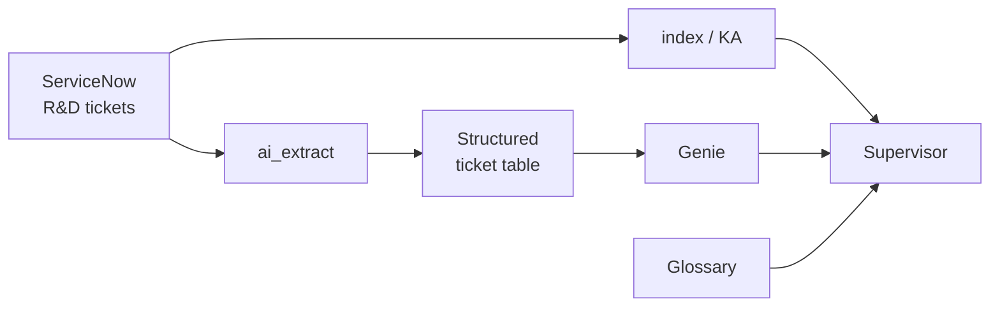
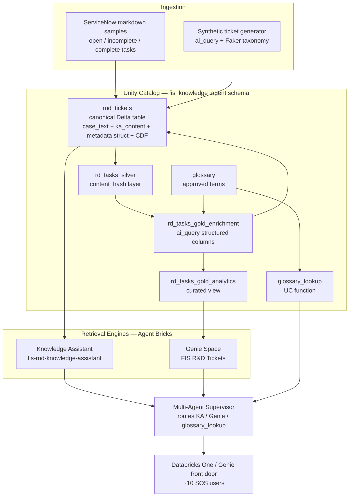

<!-- generated-by: gsd-doc-writer -->
# Architecture — FIS AI Knowledge Agent

## System Overview

The FIS AI Knowledge Agent is a Databricks Agent Bricks system that turns Fleetworthy Infrastructure Solutions' siloed ServiceNow R&D troubleshooting history into a cited, conversational knowledge agent. Its input is a natural-language question from an R&D/field-support (SOS) engineer facing an incomplete or open task (for example, a WIM reporting zero weights, an AUR camera failing, or an HTS web app crashing). Its output is a cited, actionable recommendation grounded in the most relevant prior cases.

Architecturally it is a **retrieval-and-orchestration** system layered on Unity Catalog. A single canonical Delta table is the source of truth for every R&D case. Two complementary retrieval engines read that table — a **Knowledge Assistant (KA)** for semantic similar-case retrieval with citations, and a **Genie Space** for natural-language-to-SQL over structured columns. A **Multi-Agent Supervisor (MAS)** routes each question to the right engine (or fans out to both) and resolves domain jargon via a `glossary_lookup` Unity Catalog function. A brandable **Databricks One / Genie front door** puts the whole thing in front of the ~10-person SOS team. The system runs entirely on the Databricks workspace `fevm-serverless-stable-l26d62`, in the schema `serverless_stable_l26d62_catalog.fis_knowledge_agent`.

The question workload is characterized by five query archetypes drawn from the customer's acceptance script: terminology matching, domain-expert finding, task complexity/delay analysis, priority triage of open tasks, and site-specific recurring-issue detection. Semantic archetypes route to KA; structured/aggregate archetypes route to Genie; hybrid archetypes fan out to both.

## Logical View

At the logical level there are two ingestion paths off the same ServiceNow source and three inputs into the Supervisor:



`ai_extract` turns raw tickets into a structured table that **Genie** queries with NL→SQL; the same tickets are indexed for semantic retrieval by the **KA**. The **Supervisor** orchestrates KA, Genie, and the **Glossary** — the glossary being the governed controlled vocabulary. The detailed component diagram below expands each of these into the actual Databricks assets.

## Component Diagram



Data flows left-to-right: raw ServiceNow markdown plus synthetically generated tickets land in the canonical `rnd_tickets` Delta table; an enrichment pipeline derives canonical structured columns and a segmented, acronym-expanded content column; the KA and Genie read the enriched artifacts; the Supervisor orchestrates them plus the glossary function; and the front door exposes the Supervisor to end users.

## Data Flow

A typical question moves through the system as follows:

1. **Entry.** An SOS engineer asks a question through the Databricks One / Genie front door, which routes to the Multi-Agent Supervisor under a single conversation and the user's own identity and grants.
2. **Terminology resolution.** The Supervisor calls the `glossary_lookup(term_query)` Unity Catalog function first when jargon needs disambiguation (for example, `CA` → Controller Application, `NetBooter` → WPS). It receives the term's canonical definition and `category` and passes the term plus category downstream. The `category` drives how the term is handled: a `system` term is matched as an array element, while a non-system term is matched as free text — the correctness fix that prevents a false zero count.
3. **Routing.** Based on the sub-agent tool descriptions, the Supervisor routes to the correct engine(s):
   - **Semantic archetypes** (terminology matching, similar-case retrieval, cross-site recurring patterns) → Knowledge Assistant.
   - **Structured/aggregate archetypes** (counts, priority sorting, involvement counts) → Genie Space.
   - **Hybrid archetypes** (expert-finding, complexity/delay, priority triage) → both engines, fanned out and merged.
4. **Retrieval.** The KA performs instructed retrieval over the indexed ticket content and returns similar prior cases with inline citations that resolve to the source ticket. Genie generates SQL against the curated analytics view and returns aggregates, ranked lists, or involvement counts.
5. **Synthesis.** The Supervisor merges the sub-agent results into one cited, actionable answer, applying routing/synthesis instructions that shape marquee answers (for example, priority triage classifies open tasks as easiest-with-known-fix / oldest-but-blocked / stubborn-recurring, each with a ticket pointer).
6. **Output.** The answer is returned to the user through the front door with citations that resolve back to real corpus tickets.

## Key Abstractions

The system is composed of Databricks-native assets rather than application source code. The most significant abstractions:

- **Canonical Delta table** — `serverless_stable_l26d62_catalog.fis_knowledge_agent.rnd_tickets`. One row per R&D case, holding the full `case_text`, the KA-indexed `ka_content` column, typed metadata columns, and the KA `metadata` STRUCT. Change Data Feed is enabled so the table qualifies as a Knowledge Assistant source.
- **Enrichment gold layer** — `rd_tasks_gold_enrichment` (table) and `rd_tasks_gold_analytics` (view). `ai_query`-driven enrichment adds canonical structured columns (`systems_involved`, `hardware`, `vendors`, `problem_category`, `root_cause`, `resolution_type`) plus a segmented description (`summary` / `customer_impact` / `troubleshooting` / `recommendation`). The analytics view is Genie's read surface.
- **Governed glossary** — the `glossary` table (canonical term, definition, category, synonyms/aliases, approved_by, version) and the `glossary_lookup(term_query STRING) RETURNS TABLE(term STRING, definition STRING, category STRING)` Unity Catalog function. Sourced from product docs (authoritative) merged with ServiceNow usage evidence; only approved terms are served. This is the controlled vocabulary that drives both enrichment enums and the Supervisor's terminology resolution.
- **Knowledge Assistant (KA)** — `fis-rnd-knowledge-assistant`, served at endpoint `ka-97df484b-endpoint`. An Agent Bricks Instructed Retriever indexing `rnd_tickets.ka_content` plus a glossary Volume source; returns similar-case answers with resolving citations. Queried via `POST /serving-endpoints/{endpoint}/invocations`.
- **Genie Space** — `FIS R&D Tickets` (space_id `01f185f0ce8e15cd9a92d86b3171c52e`). Natural-language-to-SQL over `rd_tasks_gold_analytics`, encoding involvement counting, open-task priority ranking, and delay/complexity signals as certified queries and instructions.
- **Multi-Agent Supervisor (MAS)** — orchestrates the three tools (KA endpoint, Genie space, `glossary_lookup` function) under one conversation. Routing is driven by sharp, disambiguating natural-language tool descriptions rather than hard-coded rules. Supervisor LLM is `databricks-claude-sonnet-4-5`. <!-- VERIFY: MAS serving endpoint id and routing-instruction contents — Agent Bricks MAS metadata is not exposed via the serving API and must be read from the Agent Bricks UI -->
- **Foundation Model API endpoints** — `databricks-claude-sonnet-4-5` powers the agents (synthesis, reasoning) and drives `ai_query` enrichment; `databricks-claude-haiku-4-5` powers the synthetic-ticket generation pass.
- **Front door** — Databricks One (with Genie as the fallback front door) provides the brandable entry point for the SOS users and routes to the Supervisor. <!-- VERIFY: Databricks One GA availability and consumer-access entitlement state in fevm-serverless-stable-l26d62 -->

## Directory Structure Rationale

This repository holds the build harness and planning artifacts for the demo — the running system lives as Databricks assets, not as an application source tree. Top-level layout:

```
FIS/
├── agents/       Build + test harnesses for the Agent Bricks assets
├── enrich/       Enrichment pipeline: glossary, gold layer, KA content builder
├── parse/        Deterministic parser + validator for the sample tickets
├── preflight/    Workspace capability preflight (region, serverless, UC, models)
├── docs/         Project documentation (this file, cost analysis, architecture HTML)
└── .planning/    Roadmap, requirements, and per-phase build records
```

- **`agents/`** — the Agent Bricks build and isolation-test scripts: `build_ka.py` / `test_ka.py` for the Knowledge Assistant, `build_genie.py` / `test_genie.py` / `genie_config.json` for the Genie Space, and the glossary/example inputs the agents consume.
- **`enrich/`** — the SQL/PySpark enrichment pipeline that builds the governed glossary, the `glossary_lookup` function, the gold enrichment layer, and the `ka_content` column the KA indexes.
- **`parse/`** — the deterministic standard-library parser that lands the real sample markdown tickets into the canonical table, plus the SQL-assertion validator that gates the table as a valid KA source.
- **`preflight/`** — the re-runnable workspace capability check that confirms Agent Bricks, the Supervisor preview, serverless + Unity Catalog, and the Foundation Model endpoints are live before any build.
- **`docs/`** — project documentation, including this architecture doc, the cost analysis, and a standalone HTML architecture diagram (`servicenow_demo_architecture.html`).
- **`.planning/`** — the roadmap, requirements, and per-phase design/build records that document how each component was constructed and verified.
