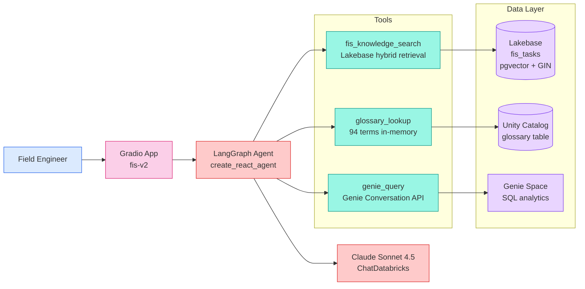

# FIS v2 Architecture — Lakebase + Custom Agent

## Overview

v2 replaces the v1 Agent Bricks stack (Knowledge Assistant + Multi-Agent Supervisor) with a **custom LangGraph agent** backed by **Lakebase (Postgres + pgvector)** for retrieval, while keeping the Genie space for quantitative analytics and adding an in-memory glossary tool.

### v1 → v2 Changes

| Component | v1 (Agent Bricks) | v2 (Custom Agent) |
| --- | --- | --- |
| Retrieval | Knowledge Assistant (KA) | Lakebase pgvector + GIN full-text |
| Orchestration | Multi-Agent Supervisor (MAS) | LangGraph `create_react_agent` |
| Glossary | UC function `glossary_lookup` | In-memory dict (pre-loaded at startup) |
| Analytics | Genie Space | Genie Space (unchanged) |
| LLM | MAS-managed | `databricks-claude-sonnet-4-5` via ChatDatabricks |
| Frontend | Databricks One / Genie front door | Gradio chat app (Databricks App) |
| Embedding | KA-managed index | `databricks-gte-large-en` (1024-dim) → pgvector |
| Hosting | Serverless (Agent Bricks) | Databricks App (service principal) |

## System Diagram



## Tool Routing

The system prompt instructs the agent to route based on question type:

| Signal | Tool | Example |
| --- | --- | --- |
| Troubleshooting, root cause, resolution | `fis_knowledge_search` | "What caused the camera misalignment at Carson?" |
| Unknown acronym or term | `glossary_lookup` | "What is OVC?" |
| Counts, rankings, aggregations | `genie_query` | "How many tasks are open by state?" |
| Chained | glossary → search | "What issues have PIPS cameras had?" (resolve PIPS, then search) |

## Hybrid Search (fis_knowledge_search)

Combines two retrieval signals from Lakebase:

1. **Vector similarity** (0.7 weight): `1 - (lakebase_vector <=> query_embedding::vector)` via IVFFlat index
2. **Full-text ranking** (0.3 weight): `ts_rank_cd(to_tsvector('english', lakebase_text), plainto_tsquery('english', query))` via GIN index

Optional filters: `location_state` (2-letter code), `status_filter` (e.g., 'Closed'). Returns TOP_K=5 results.

## Glossary (glossary_lookup)

94 approved domain terms loaded from `serverless_stable_l26d62_catalog.fis_knowledge_agent.glossary` into a Python dict at startup. Lookup path:

1. Exact match on `term` (case-insensitive)
2. Exact match on any `alias` (case-insensitive)
3. Fuzzy match via `difflib.get_close_matches(cutoff=0.5)`
4. "Not found" response

## Genie (genie_query)

Uses the Databricks Python SDK Genie Conversation API:

1. `w.genie.start_conversation(space_id, question)` → returns LRO
2. Poll until `COMPLETED` / `FAILED` / `CANCELLED` (90s timeout)
3. Extract text answer + generated SQL + query results from attachments
4. Format results as a markdown table (max 20 rows)

## Lakebase Schema

```sql
CREATE TABLE fis_tasks (
    number             TEXT PRIMARY KEY,
    title              TEXT,
    parent             TEXT,
    assignment_group    TEXT,
    assigned_to        TEXT,
    priority_level     INT,
    priority_label     TEXT,
    status             TEXT,
    workflow_status    TEXT,
    is_closed          BOOL,
    location           TEXT,
    location_state     TEXT,
    location_highway   TEXT,
    location_direction TEXT,
    location_site      TEXT,
    site_key           TEXT,
    duration_days      INT,
    problem_category   TEXT,
    summary            TEXT,
    customer_impact    TEXT,
    troubleshooting    TEXT,
    recommendation     TEXT,
    root_cause         TEXT,
    resolution         TEXT,
    resolution_type    TEXT,
    lakebase_text      TEXT,
    lakebase_vector    vector(1024)
);

CREATE INDEX idx_fis_tasks_vector
    ON fis_tasks USING ivfflat (lakebase_vector vector_cosine_ops)
    WITH (lists=10);

CREATE INDEX idx_fis_tasks_text
    ON fis_tasks USING gin (to_tsvector('english', lakebase_text));
```

## Directory Structure

```
v2/
  agent/
    fis_v2_agent.py     # 10-cell notebook: config, connection, embedding,
                        # search tool, glossary tool, Genie tool, agent, test, MLflow
  app/
    app.py              # Gradio chat app with 3 tools (standalone)
    app.yaml            # Databricks App config (Lakebase resource)
    requirements.txt    # Python dependencies
  tests/
    fis_v2_tests.py     # 11-cell test notebook: 8 suites, 35+ tests
  docs/
    plan_build.md       # Build plan with execution phases
    ARCHITECTURE_V2.md  # This file
    DEPLOYMENT_V2.md    # Step-by-step deployment guide
```
